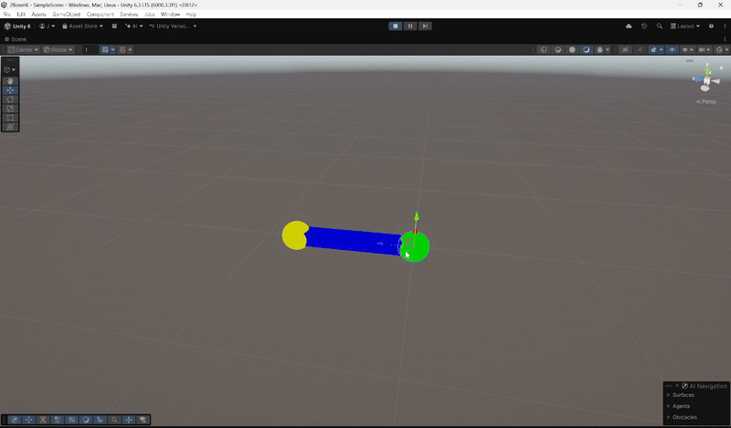

# 2BoneIK
A 2-bone IK solver built in Unity using the law of cosines.

This solver was created as part of a final project for CSS 451 Computer Graphics. It uses TNodes (a custom transform to replace Unity's component) as part of the requirements.

  

## Features
- TNodes - a custom transform component
- Customizable bone length
- Definable pole vector (align with any "up" direction)
